<font color="silver">※[README.md](README.md)のセットアップ手順にスクリーンショットを付けたものです。</font>  

# セットアップ手順
#### 前提条件
- Bluemixのアカウントを所持していること
- PCにBluemixコマンド(bxコマンド)がインストールされていること
- LINE Developersのアカウントを所持していること

#### 手順
1. [BluemixでNode.jsのランタイムを作成する](#1-bluemixでnodejsのランタイムを作成する)
1. [Gitからアプリケーションをダウンロードする](#2-gitからアプリケーションをダウンロードする)
1. [LINE Developersでbotの作成をする](#4-line-developersでbotの作成をする)
1. [LINE Developersでbotの設定をする](#5-line-developersでbotの設定をする)
1. [Bluemixでサービスを作成する](#6-bluemixでサービスを作成する)
1. [Cloudant NoSQL DBでデータベースを作成する](#7-cloudant-nosql-dbでデータベースを作成する)
1. [Conversationにサンプルデータをインポートする](#8-conversationにサンプルデータをインポートする)
1. [manifest.ymlを編集する](#9-manifestymlを編集する)
1. [bxコマンドでアプリケーションをBluemixへデプロイする](#10-bxコマンドでアプリケーションをbluemixへデプロイする)
1. [LINE Developersでホワイトリストを設定する](#11-line-developersでホワイトリストを設定する)  

### 1. BluemixでNode.jsのランタイムを作成する
**1.1**  
Bluemixで任意のアプリケーション名・ホスト名でNode.jsのランタイムを作成する(地域も任意)  
※設定は全てデフォルト

### 2. Gitからアプリケーションをダウンロードする
**2.1**  
本リモートリポジトリから任意のディレクトリにzipファイルを解凍する  
  

### 3. LINE Developersでbotの作成をする  
**3.1**  
https://developers.line.me/ja/  
上記のLINE DevelopersのURLから「Messaging API(ボット)をはじめる」をクリックする  
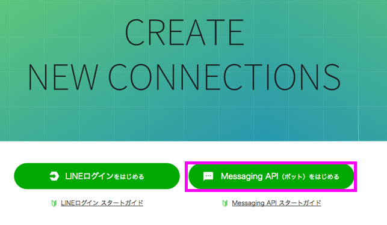  

**3.2**  
LINEのメールアドレスとパスワードでログインする  
  

**3.3**  
新規Channel作成画面のサイドメニューから「新規プロバイダー作成」をクリックする  
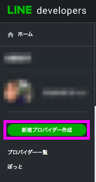  

**3.4**  
任意のプロバイダー名を入力し「確認」→「作成」をクリックする  
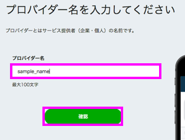  

**3.5**  
プロバイダーが作成された後「Messaging API」をクリックする  
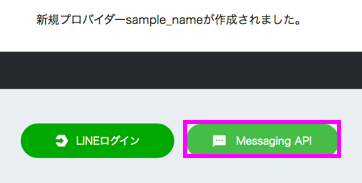  

**3.6**  
各項目を以下のように設定し、規約への同意にチェックした後「作成」をクリックする  
- アプリ名：任意のアプリ名を入力  
- アプリ説明：任意のアプリ説明を入力  
- プラン：フリーを選択  
- 大業種・少業種：適切な項目を選択  
- メールアドレス：お知らせを受け取るメールアドレスを入力  

**3.7**  
以下のような画面が表示されればbotの作成は完了  
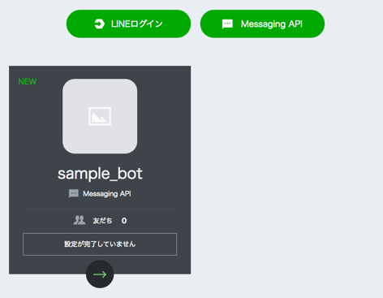
### 4. LINE Developersでbotの設定をする  
**4.1**  
(3.7)の画面から枠で囲まれた部分をクリックする  
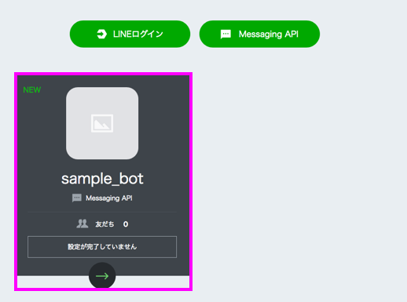  

**4.2**  
Channel基本設定の画面→メッセージ送受信設定→アクセストークン(ロングターム)から「再発行」をクリックする  
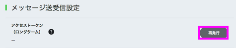  

**4.3**  
表示されるポップアップウィンドウから「再発行」をクリックし、アクセストークンが入力されることを確認し、メモする  
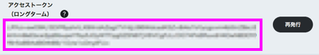  

**4.4**  
Webhook送信の「利用する」を選択し「更新」をクリックし、Webhook URLに「<(1.1)で設定したホスト名>.mybluemix.net/api」を入力→「更新」をクリックする  
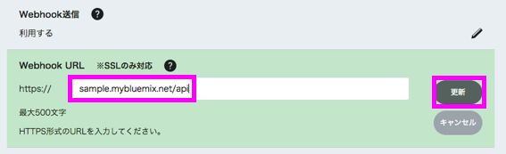  

**4.5**  
LINE@機能の利用→自動応答メッセージ→「利用しない」を選択し「更新」をクリック  
友だち追加時あいさつ→「利用しない」を選択し「更新」をクリック  
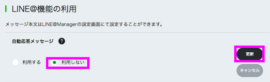  
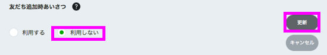  

**4.6**  
スマートフォンでLINEアプリを起動し、「その他」→「友だち追加」→「QRコード」でQRコードを読み込み、友だち追加する  
(全てのセットアップが終わると、友だち追加したbotを利用できるようになります)  


### 5. Bluemixでサービスを作成する
**5.1**  
(1.1)でランタイムを作成したスペースで以下のサービスを作成する  
作成する際、「サービス名」をメモする  
- Cloudant NoSQL DB(データ&分析カテゴリ)  
- Conversation(Watsonカテゴリ)  
- Tone Analyzer(Watsonカテゴリ)  
- Language Translator(Watsonカテゴリ)  
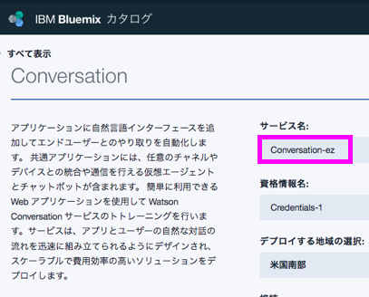  

### 6. Cloudant NoSQL DBでデータベースを作成する  
**6.1**  
作成したCloudant NoSQL DBのダッシュボードを開く  
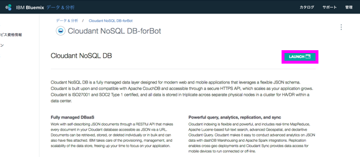  

**6.2**  
画面上部の「Create Database」をクリックし "conversation" と入力し「Create」をクリックする  
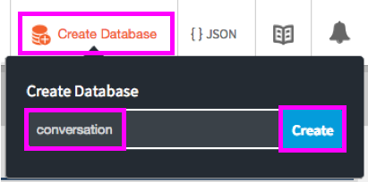  

### 7. Conversationにサンプルデータをインポートする  
**7.1**  
作成したConversationのダッシュボードを開く  
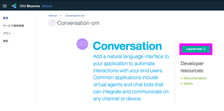  

**7.2**  
以下の枠で囲まれたアイコンをクリックし、「Choose a file」をクリックして(2.1)でダウンロードしたアプリケーションの setting > sampleData.json を選択する  
**7.3**  
「Everything（Intents,Entities,and Dialog)」にチェックが入っていることを確認し、「Import」をクリックする  
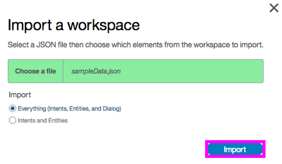  

**7.4**  
枠で囲まれた部分をクリックして、ワークスペース一覧画面を表示する  
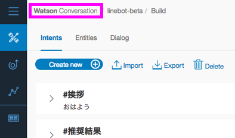  

**7.5**  
インポートしたワークスペースの右上のアイコン(3点マーク)をクリック→「View details」をクリックする  
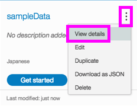  

**7.6**  
以下の枠で囲まれたアイコンをクリックするとWorkspace IDがコピーされるので、メモする  
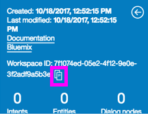


### 8. manifest.ymlを編集する  
**8.1**  
(2.1)でダウンロードしたアプリケーションの「manifest.yml」を開き、以下のように編集する  
- 「name」→(1.1)で設定したアプリケーション名  
- 「host」→(1.1)で設定したホスト名(デフォルトではアプリケーション名と同じ)  
- 「services」→(6.1)でメモした各サービス名  
- 「lineBotAccessToken」→(5.3)でメモしたLINE botのアクセストークン  
- 「convesationID」→(8.6)でメモしたConversationのWorkspace ID  

```
applications:
- path: .
  memory: 128M
  instances: 1
  domain: mybluemix.net
  name: <アプリケーション名>
  host: <ホスト名>
  disk_quota: 1024M
  services:
   - <Cloudant NoSQL DBのサービス名(例:Coudant NoSQL DB-Aa)>
   - <Tone Analyzerのサービス名>
   - <Conversationのサービス名>
   - <Language Tlanslatorのサービス名>
  env:
   lineBotAccessToken : <LINE botのアクセストークン>
   convesationID : <ConversationのWorkspace ID>
```  

### 9. bxコマンドでアプリケーションをBluemixへデプロイする  
**9.1**  
Bluemixで、(1.1)で作成したランタイムの概要画面の左メニューから「ログ」をクリックしログ閲覧の状態にしておく  
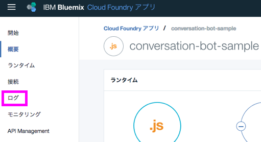  

**9.2**  
コマンドプロンプト(Windows)もしくはターミナル(MacOS)を開き、(2.1)で解凍したアプリケーションのディレクトリに移動する  
**9.3**  
以下コマンドを実行し、アプリケーションをBluemixへデプロイする  
`bx app push`    

### 10. LINE Developersでホワイトリストを設定する
**10.1**  
(9.3)のデプロイが完了した後、(9.1)で閲覧状態にしたログで表示される以下のIPアドレスをメモする  
  

**10.2**  
(3.1)のURLを開き「Messaging API(ボット)を始める」をクリックする  
  

**10.3**  
(3.4)で作成したプロバイダー名をクリックし、その後(3.6)で作成したアプリ(bot)をクリックする  
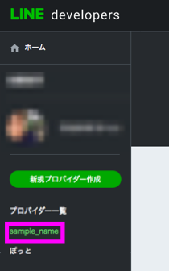
  

**10.4**  
画面左のメニューから、「セキュリティ管理」をクリックする  
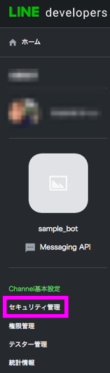  

**10.5**  
「追加」をクリックする  
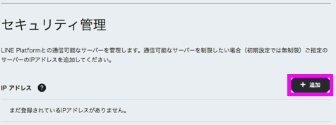  

**10.6**  
(10.1)でメモしたIPアドレスを入力し「確認」をクリックする  
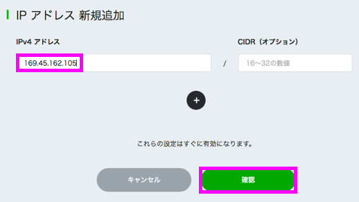  

**10.7**  
「登録」をクリックする  
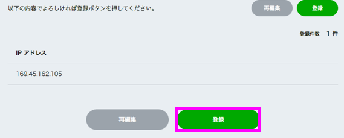  

**10.8**  
「新しいIPアドレスが登録されました」と表示されればホワイトリストの設定は完了  
※予期せぬエラー等でアプリケーションが再起動された際はIPアドレスが変わるので、(10.1)~(10.7)の手順でホワイトリストを設定し直してください)  
