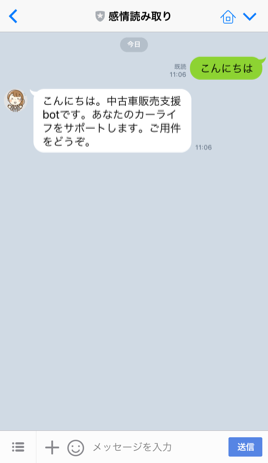
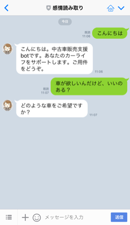
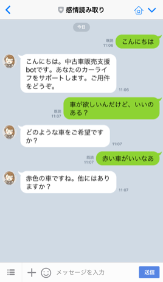
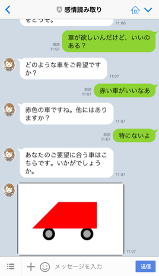
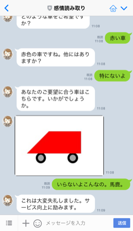
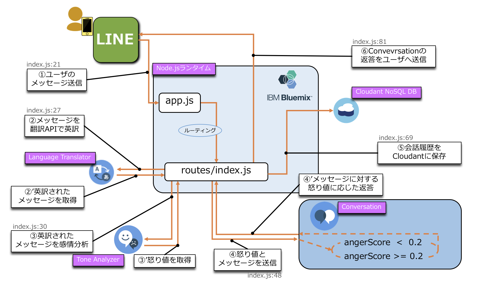

### 目次
1. [アプリの概要](#1-アプリの概要)
1. [アプリの使い方](#2-アプリの使い方)
1. [セットアップ手順](#3-セットアップ手順)
1. [アプリの解説](#4-アプリの解説)

# 1. アプリの概要
中古車販売の支援を行うLINE botです。  
バックエンドでは各種APIを用いた感情分析が行われており、
「怒り」の度合いに応じた対応をすることができます。

#### 使用環境
- 基盤:IBM Bluemix
- 使用言語:Node.js  

#### 使用API
- LINE Message API (LINEをインタフェースにする機能)
- Watson Conversation (会話を成立させる機能)
- Watson Tone Analyzer (感情を分析する機能)
- Watson Language Translator (日本語テキストを英語テキストに翻訳する機能)
- Cloudant NoSQL DB (会話のログを保管する機能)  

# 2. アプリの使い方  
会話フローの例　※本botは簡易的なサンプルですが、Watson Conversationを作り込むことにより、複雑かつ人間味のある会話が可能になります。  
1. 「こんにちは」や「おはよう」と入力すると、挨拶が返ってきて用件を聞かれる  
  

2. 「車が欲しい」や「車を買いたい」と入力すると、どのような車が良いのか聞かれる  
  

3. 「赤」や「黒」などの色を入力すると、他に希望があるか聞かれる  
  

4. 「特に無い」や「そのくらい」と入力すると、希望に沿った車の画像が送られる  
  

5. 送られた画像に対して「いいね、ありがとう」や「かっこいいね」といった入力をすると、終わりの挨拶が返ってくる  
  

**<font color="Red">送られた画像に対して怒ったようなコメントをすると、怒りの度合いを検知して謝罪が返ってきます</font>**  
　　　  

# Deploy to IBM Cloud!
[](https://bluemix.net/deploy?repository=https://github.com/motokazu/liteaccount-conversation-bot-sample.git&branch=master)

# 3. セットアップ手順(step)
#### 前提条件
- Bluemixのアカウントを所持していること
- PCにBluemixコマンド(bxコマンド)がインストールされていること
- LINE Developersのアカウントを所持していること

#### 手順
本ドキュメントは簡易的な手順のご説明です。  
**スクリーンショット付きの手順をご希望の方は[こちら](HowToSetup.md)をご覧ください。**
1. [BluemixでNode.jsのランタイムを作成する](#1-bluemixでnodejsのランタイムを作成する)
1. [Gitからアプリケーションをダウンロードする](#2-gitからアプリケーションをダウンロードする)
1. [LINE Developersでbotの作成をする](#4-line-developersでbotの作成をする)
1. [LINE Developersでbotの設定をする](#5-line-developersでbotの設定をする)
1. [Bluemixでサービスを作成する](#6-bluemixでサービスを作成する)
1. [Cloudant NoSQL DBでデータベースを作成する](#7-cloudant-nosql-dbでデータベースを作成する)
1. [Conversationにサンプルデータをインポートする](#8-conversationにサンプルデータをインポートする)
1. [manifest.ymlを編集する](#9-manifestymlを編集する)
1. [bxコマンドでアプリケーションをBluemixへデプロイする](#10-bxコマンドでアプリケーションをbluemixへデプロイする)
1. [LINE Developersでホワイトリストを設定する](#11-line-developersでホワイトリストを設定する)  

### 1. BluemixでNode.jsのランタイムを作成する
**1.1.**  
Bluemixで任意のアプリケーション名・ホスト名でNode.jsのランタイムを作成する(地域も任意)  
※設定は全てデフォルト

### 2. Gitからアプリケーションをダウンロードする
**2.1**    
本リモートリポジトリから任意のディレクトリにプロジェクトをcloneする

### 3. LINE Developersでbotの作成をする  
**3.1**  
https://developers.line.me/ja/  
上記のLINE DevelopersのURLから「Messaging API(ボット)をはじめる」をクリックする  

**3.2**  
LINEのメールアドレスとパスワードでログインする  

**3.3**  
新規Channel作成画面のサイドメニューから「新規プロバイダー作成」をクリックする  

**3.4**  
任意のプロバイダー名を入力し「確認」→「作成」をクリックする  

**3.5**  
プロバイダーが作成された後「Messaging API」をクリックする  

**3.6**  
各項目を以下のように設定し、規約への同意にチェックした後「作成」をクリックする  
- アプリ名：任意のアプリ名を入力  
- アプリ説明：任意のアプリ説明を入力  
- プラン：フリーを選択  
- 大業種・少業種：適切な項目を選択  
- メールアドレス：お知らせを受け取るメールアドレスを入力  

**3.7**  
設定したアプリ名のボックスが表示されればbotの作成は完了  

### 5. LINE Developersでbotの設定をする  
**4.1**  
(3.7)で表示されているボックスをクリックする  

**4.2**  
Channel基本設定の画面→メッセージ送受信設定→アクセストークン(ロングターム)から「再発行」をクリックする  

**4.3**  
表示されるポップアップウィンドウから「再発行」をクリックし、アクセストークンが入力されることを確認し、メモする  

**4.4**  
Webhook送信の「利用する」を選択し「更新」をクリックし、Webhook URLに「<(1.1)で設定したホスト名>.mybluemix.net/api」を入力→「更新」をクリックする  

**4.5**  
LINE@機能の利用→自動応答メッセージ→「利用しない」を選択し「更新」をクリック  
友だち追加時あいさつ→「利用しない」を選択し「更新」をクリック  

**4.6**  
スマートフォンでLINEアプリを起動し、「その他」→「友だち追加」→「QRコード」でQRコードを読み込み、友だち追加する  
(全てのセットアップが終わると、友だち追加したbotを利用できるようになります)  

### 5. Bluemixでサービスを作成する
**5.1**  
(1.1)でランタイムを作成したスペースで以下のサービスを作成する  
作成する際、「サービス名」をメモする  
- Cloudant NoSQL DB(データ&分析カテゴリ)  
- Conversation(Watsonカテゴリ)  
- Tone Analyzer(Watsonカテゴリ)  
- Language Translator(Watsonカテゴリ)  

### 6. Cloudant NoSQL DBでデータベースを作成する  
**6.1**  
作成したCloudant NoSQL DBのダッシュボードを開く  

**6.2**  
画面上部の「Create Database」をクリックし "conversation" と入力し「Create」をクリックする  

### 7. Conversationにサンプルデータをインポートする  
**7.1**  
作成したConversationのダッシュボードを開く  

**7.2**  
「Create」の右のアイコンをクリックし、「Choose a file」をクリックして(2.1)でダウンロードしたアプリケーションの setting > sampleData.json を選択する  

**7.3**  
「Everything（Intents,Entities,and Dialog)」にチェックが入っていることを確認し、「Import」をクリックする  

**7.4**  
画面上部の「Watson Conversation」をクリックして、ワークスペース一覧画面を表示する  

**7.5**  
インポートしたワークスペースの右上のアイコン(3点マーク)をクリック→「View details」をクリックする  

**7.6**  
「Workspace ID」をメモする  

### 8. manifest.ymlを編集する  
**8.1**  
(2.1)でダウンロードしたアプリケーションの「manifest.yml」を開き、以下のように編集する  
- 「name」→(1.1)で設定したアプリケーション名  
- 「host」→(1.1)で設定したホスト名(デフォルトではアプリケーション名と同じ)  
- 「services」→(5.1)でメモした各サービス名  
- 「lineBotAccessToken」→(4.3)でメモしたLINE botのアクセストークン  
- 「convesationID」→(7.6)でメモしたConversationのWorkspace ID  

  ```
  applications:
  - path: .
    memory: 128M
    instances: 1
    domain: mybluemix.net
    name: <アプリケーション名>
    host: <ホスト名>
    disk_quota: 1024M
    services:
     - <Cloudant NoSQL DBのサービス名(例:Coudant NoSQL DB-Aa)>
     - <Tone Analyzerのサービス名>
     - <Conversationのサービス名>
     - <Language Translatorのサービス名>
    env:
     lineBotAccessToken : <LINE botのアクセストークン>
     convesationID : <ConversationのWorkspace ID>
  ```

### 9. bxコマンドでアプリケーションをBluemixへデプロイする  
**9.1**  
Bluemixで、(1.1)で作成したランタイムの概要画面の左メニューから「ログ」をクリックしログ閲覧の状態にしておく  

**9.2**  
コマンドプロンプト(Windows)もしくはターミナル(MacOS)を開き、(2.1)で解凍したアプリケーションのディレクトリに移動する  

**9.3**  
以下コマンドを実行し、アプリケーションをBluemixへデプロイする  
`bx app push`  

### 10. LINE Developersでホワイトリストを設定する
**10.1**  
(9.3)のデプロイが完了した後、(9.1)で閲覧状態にしたログで以下のように表示されるIPアドレスをメモする  
`IPアドレス[xxx.xx.xxx.xx]をLINEBotのWhiteListへ追加してください。`  

**10.2**  
(3.1)のURLを開き「Messaging API(ボット)を始める」をクリックする  

**10.3**  
(3.4)で作成したプロバイダー名をクリックし、その後(3.6)で作成したアプリ(bot)をクリックする  

**10.4**  
画面左のメニューから、「セキュリティ管理」をクリックする  

**10.5**  
「追加」をクリックする  

**10.6**  
(10.1)でメモしたIPアドレスを入力し「確認」をクリックする  
(この時 サブネットマスクは入力不要)

**10.7**  
「登録」をクリックする  

**10.8**  
「新しいIPアドレスが登録されました」と表示されればホワイトリストの設定は完了  
※予期せぬエラー等でアプリケーションが再起動された際はIPアドレスが変わるので、(10.1)~(10.7)の手順でホワイトリストを設定し直してください)  

# 4. アプリの解説  
本アプリは下図のようなフローでデータが流れています。  
図の①〜⑥は、routes > index.jsのコメントアウトに書かれている①〜⑥と対応しています。  
ソースコードを読む際にお役立てください。  

